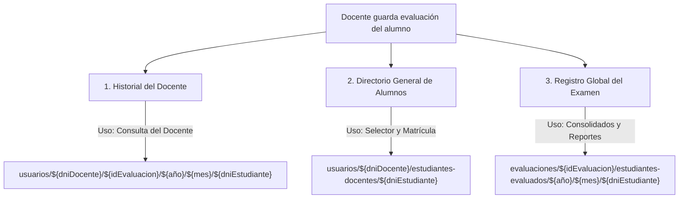

# Propuesta de Arquitectura: Consolidados en Tiempo Real (Incremental)

Este documento detalla la propuesta técnica para migrar el sistema de reportes estadísticos del proyecto, pasando de un proceso por lotes offline (consolidación manual por Cloud Function ejecutada a demanda) a una arquitectura distribuida basada en **actualizaciones incrementales en tiempo real** utilizando disparadores de Firestore.

---

## 1. Introducción y Objetivos
Actualmente, el procesamiento y cruce de datos de los estudiantes evaluados se genera a petición del usuario administrador mediante la ejecución de una Cloud Function orquestadora (`startFullConsolidation`). Este proceso lee todo el universo de estudiantes, realiza agrupaciones en memoria y exporta archivos estáticos JSON a Cloud Storage, los cuales son posteriormente descargados por el cliente.

### Objetivos de la Nueva Arquitectura:
1. **Eliminar la latencia de espera:** Los gráficos de los docentes y directores deben reaccionar instantáneamente conforme se evalúa a los estudiantes.
2. **Reducir costos de lectura en Firestore:** Reemplazar el escaneo masivo recurrente ($O(N)$ lecturas de la base de datos) por incrementos atómicos rápidos ($O(1)$ escrituras por cambio).
3. **Automatización:** Retirar la necesidad de contar con un botón manual de consolidación para la visualización del día a día.
4. **Transición sin fricción (Zero Downtime):** Garantizar la compatibilidad con el sistema actual mientras dura el periodo de migración progresiva.

---

## 2. Análisis del Flujo de Datos Actual

Cuando un docente califica a un estudiante desde el componente [index.tsx (evaluar-estudiante)](file:///home/frecodev/Documentos/eva/pages/docentes/evaluaciones/tercerNivel/pruebas/prueba/evaluar-estudiante/index.tsx), la función `salvarPreguntRespuestaEstudiante` del hook [useAgregarEvaluaciones](file:///home/frecodev/Documentos/eva/features/hooks/useAgregarEvaluaciones.tsx) realiza escrituras simultáneas en tres rutas:



### Rutas Clave:
1. **Historial del Docente:** `usuarios/${dniDocente}/${idEvaluacion}/${año}/${mes}/${dniEstudiante}`
   * *Propósito:* Almacena las respuestas y puntajes del estudiante bajo la carpeta de su propio profesor para asegurar privacidad de acceso.
2. **Directorio General:** `usuarios/${dniDocente}/estudiantes-docentes/${dniEstudiante}`
   * *Propósito:* Almacena datos demográficos del estudiante para autocompletar formularios y búsquedas del docente.
3. **Registro Global:** `evaluaciones/${idEvaluacion}/estudiantes-evaluados/${año}/${mes}/${dniEstudiante}`
   * *Propósito:* Colección plana y centralizada que contiene a **todos** los alumnos evaluados en la prueba actual. **Esta es la fuente que usa el consolidado actual.**

---

## 3. Propuesta de Arquitectura en Tiempo Real

Proponemos la creación de una función de background (Trigger de Firestore V2) que escuche eventos de escritura sobre el **Registro Global (Ruta 3)** y realice sumas/restas acumuladas sobre documentos específicos de resumen.

### Flujo Físico de Datos
```
[Escritura en: evaluaciones/{id}/estudiantes-evaluados/.../{dniEstudiante}]
                                │
                                ▼ (Disparo automático)
                ┌────────────────────────────────┐
                │ Cloud Function (onCallTrigger) │
                │   - Calcula Diff Aritmético    │
                └───────────────┬────────────────┘
                                │
          ┌─────────────────────┼─────────────────────┐
          ▼                     ▼                     ▼
┌──────────────────┐  ┌──────────────────┐  ┌──────────────────┐
│  Realtime Doc    │  │  Realtime Doc    │  │  Realtime Doc    │
│    (Docente)     │  │    (Director)    │  │   (Preguntas)    │
└──────────────────┘  └──────────────────┘  └──────────────────┘
```

### El Algoritmo de Cálculo Diferencial (Diff)
Para evitar leer de nuevo todos los estudiantes de la base de datos, el trigger computa el cambio exacto comparando el estado previo (`change.before.data()`) y el estado posterior (`change.after.data()`):

```typescript
// Lógica para determinar el tipo de evento
const isNew = !change.before.exists && change.after.exists;
const isDelete = change.before.exists && !change.after.exists;
const isUpdate = change.before.exists && change.after.exists;

const before = change.before.data() || {};
const after = change.after.data() || {};
```

1. **Si es una nueva evaluación (`isNew`):**
   * Incrementa el total de estudiantes evaluados en `+1`.
   * Suma el puntaje obtenido a la suma general.
   * Incrementa en `+1` la categoría del nivel obtenido por el estudiante en su respectivo rango de puntaje.
   * Para cada pregunta, incrementa en `+1` la letra de la opción seleccionada y el `total` de esa pregunta.

2. **Si es una actualización de respuestas o corrección (`isUpdate`):**
   * Compara el puntaje: `puntajeDiff = (after.puntaje || 0) - (before.puntaje || 0)`. Suma ese diferencial a la suma general.
   * Compara el nivel: Si pasó de "Inicio" a "Proceso", decrementa `"niveles.inicio"` en `-1` e incrementa `"niveles.proceso"` en `+1`.
   * Para cada pregunta: Si cambió su respuesta de `"A"` a `"B"`, decrementa `"A"` en `-1` e incrementa `"B"` en `+1`. El contador `total` no varía.

3. **Si es una eliminación de registro (`isDelete`):**
   * Decrementa el total de estudiantes en `-1`.
   * Resta el puntaje: `puntajeDiff = -before.puntaje`.
   * Decrementa en `-1` el nivel que tenía.
   * Para cada pregunta, decrementa en `-1` la alternativa que había elegido y el `total` de la pregunta.

---

## 4. Diseño de Modelos de Datos en Firestore (Acumulados)

Almacenaremos los datos agregados en documentos de Firestore para permitir que el frontend los consuma mediante suscripciones directas de tiempo real.

### A. Colección: Acumulados de Docentes
* **Ruta:** `evaluaciones/${idEvaluacion}/consolidados_realtime/profesores/${dniDocente}`
* **Estructura del Documento:**
```json
{
  "dniDocente": "80509804",
  "nombres": "Ana María",
  "apellidos": "Paredes",
  "totalEstudiantes": 25,
  "sumaPuntajes": 450,
  "niveles": {
    "inicio": 2,
    "proceso": 8,
    "satisfactorio": 15
  },
  "ultimaActualizacion": "2026-06-10T18:00:00Z"
}
```

### B. Colección: Acumulados de Directores (Escuelas)
* **Ruta:** `evaluaciones/${idEvaluacion}/consolidados_realtime/directores/${dniDirector}`
* **Estructura del Documento:** *(Idéntica a la del docente, acumulando el progreso de todas las aulas de la institución del director).*

### C. Colección: Reporte por Preguntas (Estructura Plana)
* **Ruta:** `evaluaciones/${idEvaluacion}/consolidados_realtime/preguntas_${año}_${mes}/items/${idPregunta}`
* **Estructura del Documento:**
```json
{
  "id": "1",
  "total": 120,
  "A": 45,
  "B": 60,
  "C": 15
}
```

> [!TIP]
> **Compatibilidad Frontend Inmediata:**
> El componente [ReporteEvaluacionPorPregunta.tsx](file:///home/frecodev/Documentos/eva/components/reportes/ReporteEvaluacionPorPregunta.tsx) del frontend ya posee una bifurcación lógica en la línea 165 (`// RESPALDO ESTRUCTURA ANTIGUA`) que lee exactamente este formato plano (donde las alternativas son propiedades directas del objeto). Esto significa que **podemos transicionar a tiempo real sin necesidad de rediseñar las gráficas de Chart.js del cliente.**

---

## 5. Ejemplo de Código Propuesto para la Cloud Function Trigger

Este es el borrador del trigger en Typescript para `functions/src/realtimeAggregator.ts` (deshabilitado hasta la transición):

```typescript
import { onDocumentWritten } from 'firebase-functions/v2/firestore';
import * as admin from 'firebase-admin';
import { FieldValue } from 'firebase-admin/firestore';

export const aggregateStudentEvaluationRealtime = onDocumentWritten(
  'evaluaciones/{idEvaluacion}/estudiantes-evaluados/{año}/{mes}/{dniEstudiante}',
  async (event) => {
    const db = admin.firestore();
    const { idEvaluacion, año, mes } = event.params;
    
    const before = event.data?.before.data();
    const after = event.data?.after.data();
    
    // Determinar valores de incremento/decremento
    const isNew = !event.data?.before.exists && event.data?.after.exists;
    const isDelete = event.data?.before.exists && !event.data?.after.exists;
    
    let studentChange = 0;
    let scoreChange = 0;
    let oldLevel: string | null = null;
    let newLevel: string | null = null;
    let dniDocente = after?.dniDocente || before?.dniDocente;
    let dniDirector = after?.dniDirector || before?.dniDirector;
    
    if (isNew) {
      studentChange = 1;
      scoreChange = after?.puntaje || 0;
      newLevel = after?.nivel || null;
    } else if (isDelete) {
      studentChange = -1;
      scoreChange = -(before?.puntaje || 0);
      oldLevel = before?.nivel || null;
    } else {
      // Modificación (Update)
      scoreChange = (after?.puntaje || 0) - (before?.puntaje || 0);
      if (before?.nivel !== after?.nivel) {
        oldLevel = before?.nivel || null;
        newLevel = after?.nivel || null;
      }
    }
    
    // 1. Preparar lote de actualización para Docentes y Directores
    const batch = db.batch();
    
    if (dniDocente) {
      const docenteRef = db.doc(`evaluaciones/${idEvaluacion}/consolidados_realtime/profesores/${dniDocente}`);
      const updateData: any = {
        totalEstudiantes: FieldValue.increment(studentChange),
        sumaPuntajes: FieldValue.increment(scoreChange),
        ultimaActualizacion: FieldValue.serverTimestamp()
      };
      if (oldLevel) updateData[`niveles.${oldLevel.toLowerCase()}`] = FieldValue.increment(-1);
      if (newLevel) updateData[`niveles.${newLevel.toLowerCase()}`] = FieldValue.increment(1);
      
      batch.set(docenteRef, updateData, { merge: true });
    }
    
    if (dniDirector) {
      const directorRef = db.doc(`evaluaciones/${idEvaluacion}/consolidados_realtime/directores/${dniDirector}`);
      const updateData: any = {
        totalEstudiantes: FieldValue.increment(studentChange),
        sumaPuntajes: FieldValue.increment(scoreChange),
        ultimaActualizacion: FieldValue.serverTimestamp()
      };
      if (oldLevel) updateData[`niveles.${oldLevel.toLowerCase()}`] = FieldValue.increment(-1);
      if (newLevel) updateData[`niveles.${newLevel.toLowerCase()}`] = FieldValue.increment(1);
      
      batch.set(directorRef, updateData, { merge: true });
    }
    
    // 2. Procesar diferencias en respuestas por preguntas
    const beforeAnswers = before?.respuestas || {};
    const afterAnswers = after?.respuestas || {};
    const allQuestions = Array.from(new Set([...Object.keys(beforeAnswers), ...Object.keys(afterAnswers)]));
    
    for (const qId of allQuestions) {
      const qRef = db.doc(`evaluaciones/${idEvaluacion}/consolidados_realtime/preguntas_${año}_${mes}/items/${qId}`);
      const qUpdate: any = {};
      
      const oldAns = beforeAnswers[qId];
      const newAns = afterAnswers[qId];
      
      if (isNew && newAns) {
        qUpdate['total'] = FieldValue.increment(1);
        qUpdate[newAns.toUpperCase()] = FieldValue.increment(1);
      } else if (isDelete && oldAns) {
        qUpdate['total'] = FieldValue.increment(-1);
        qUpdate[oldAns.toUpperCase()] = FieldValue.increment(-1);
      } else if (oldAns !== newAns) {
        if (oldAns) qUpdate[oldAns.toUpperCase()] = FieldValue.increment(-1);
        if (newAns) qUpdate[newAns.toUpperCase()] = FieldValue.increment(1);
      }
      
      if (Object.keys(qUpdate).length > 0) {
        batch.set(qRef, qUpdate, { merge: true });
      }
    }
    
    await batch.commit();
  }
);
```

---

## 6. Integración en el Frontend

En el cliente, en lugar de realizar una descarga estática (Fetch HTTP) de la URL del consolidado, nos suscribiremos directamente a Firestore.

### Código Frontend Anterior (Carga estática):
```typescript
const response = await fetch(urlDeStorage);
const res = await response.json();
setDataDirectoresBar(res.data);
```

### Código Frontend Nuevo (Suscripción en Tiempo Real):
```typescript
import { onSnapshot, doc } from 'firebase/firestore';

useEffect(() => {
  const idEval = route.query.idEvaluacion;
  if (!idEval || !dniDocente) return;

  const docRef = doc(db, `evaluaciones/${idEval}/consolidados_realtime/profesores/${dniDocente}`);
  
  const unsubscribe = onSnapshot(docRef, (snapshot) => {
    if (snapshot.exists()) {
      const data = snapshot.data();
      // Mapear los datos al formato requerido por la UI
      setDataDocente(data);
    }
  });

  return () => unsubscribe();
}, [idEvaluacion, dniDocente]);
```

### Próximos cambios para frontend en reporte de evaluación (Suma de Shards en Tiempo Real)

Para visualizar en tiempo real el consolidado global de alternativas por pregunta (sin filtros regionales activos), se reemplazará la descarga estática del archivo JSON de Storage por una suscripción directa a las colecciones de shards de Firestore de cada pregunta.

#### Algoritmo de Suscripción y Sumarización:
1. **Obtención de preguntas:** Utilizar la lista de preguntas ordenadas (`preguntasOrdenadas`) del examen para mapear los IDs correspondientes.
2. **Suscripción individual por pregunta:** Iniciar un listener `onSnapshot` de Firestore por cada pregunta a la ruta de sus shards:
   `evaluaciones/${idEval}/consolidados_realtime/preguntas_${yearSelected}_${monthSelected}/items/${qId}/shards`
3. **Consolidación en el Cliente:** Cada vez que un shard se actualiza, sumar los contadores (`A`, `B`, `C`, `D`, `total`) de todos los fragmentos del snapshot para esa pregunta y actualizar el estado `dataReportePreguntas` de manera reactiva:

```typescript
useEffect(() => {
  const idEval = route.query.idEvaluacion;
  if (!idEval || monthSelected === undefined || !yearSelected || preguntasOrdenadas.length === 0) return;

  const unsubscribes = preguntasOrdenadas.map((pregunta) => {
    const qId = pregunta.id;
    const shardsRef = collection(db, `evaluaciones/${idEval}/consolidados_realtime/preguntas_${yearSelected}_${monthSelected}/items/${qId}/shards`);
    
    return onSnapshot(shardsRef, (snapshot) => {
      let total = 0;
      const alternativasAcum: Record<string, number> = {};
      
      if (Array.isArray(pregunta.alternativas)) {
        pregunta.alternativas.forEach(alt => {
          const altId = String(alt.alternativa || alt.id || '').toUpperCase();
          if (altId) alternativasAcum[altId] = 0;
        });
      }

      snapshot.forEach((doc) => {
        const shardData = doc.data();
        for (const [key, val] of Object.entries(shardData)) {
          if (key === 'total') {
            total += val as number;
          } else {
            const uKey = key.toUpperCase();
            alternativasAcum[uKey] = (alternativasAcum[uKey] || 0) + (val as number);
          }
        }
      });

      setDataReportePreguntas((prev) => {
        const index = prev.findIndex((item) => item.id === qId);
        const updatedQuestionData = {
          id: qId,
          total,
          ...alternativasAcum, // Compatible con la estructura plana antigua
          alternativas: Array.isArray(pregunta.alternativas) ? pregunta.alternativas.map(alt => {
            const altId = String(alt.alternativa || alt.id || '').toUpperCase();
            return {
              id: altId,
              cantidad: alternativasAcum[altId] || 0,
              esCorrecta: altId === String(pregunta.respuesta || '').toUpperCase(),
              descripcion: alt.descripcion || ''
            };
          }) : []
        };

        if (index === -1) {
          return [...prev, updatedQuestionData].sort((a, b) => {
            const orderA = preguntasMap.get(a.id)?.order || 0;
            const orderB = preguntasMap.get(b.id)?.order || 0;
            return orderA - orderB;
          });
        } else {
          const newArray = [...prev];
          newArray[index] = updatedQuestionData;
          return newArray;
        }
      });
    });
  });

  return () => {
    unsubscribes.forEach((unsub) => unsub());
  };
}, [route.query.idEvaluacion, monthSelected, yearSelected, preguntasOrdenadas, preguntasMap]);
```

---

## 7. Manejo de Casos de Borde (Edge Cases)

1. **Modificaciones Concurrentes en el Mismo Colegio (Hotspots de Directores):**
   * Firestore soporta miles de operaciones de escritura concurrentes en la misma colección, pero tiene un límite suave de aproximadamente 1 escritura por segundo sobre un único documento. 
   * Si 10 profesores de una misma escuela guardan notas al mismo tiempo, el documento del director de esa escuela podría experimentar latencia.
   * *Mitigación:* La probabilidad de colisión exacta al segundo es baja. De ser necesario, se puede usar una Cloud Function con "debounce" o tareas encoladas, pero para la escala actual, el uso directo de `FieldValue.increment()` es suficiente y seguro.
2. **Cambios de Sección o Matrícula:**
   * Si se edita la sección de un alumno (p. ej. de la "A" a la "B"), el trigger detectará la diferencia en el campo `seccion` y restará del acumulado de la sección A e incrementará el de la B de forma atómica.
3. **Control de Consistencia Inicial:**
   * Si por alguna razón el trigger fallara o se perdiera la sincronización, se mantendrá un script administrativo para reconstruir los acumulados en tiempo real escaneando la base de datos de manera puntual.

---

## 8. Estrategia de Rollout (Implementación Progresiva)

```
┌─────────────────────────────────┐
│ Espec. / Admins (Consolidado)    ├────────► Botón manual sigue activo (Escribe JSON en Storage)
└─────────────────────────────────┘
                                                  ▲ (Verificación en paralelo de consistencia)
┌─────────────────────────────────┐               ▼
│ Docentes y Directores           ├────────► Comienzan a leer desde /consolidados_realtime
└─────────────────────────────────┘          (Si no existe, fallback al JSON de Storage)
```

1. **Fase 1 (Paralelo Silencioso):** Desplegar la Cloud Function del Trigger. Dejar que escriba en Firestore en segundo plano sin cambiar el frontend. Comparar mediante scripts que los totales en Firestore coincidan al 100% con los consolidados manuales.
2. **Fase 2 (Activación de Tiempo Real):** Modificar el cliente de docentes y directores para suscribirse a Firestore. Mantener los archivos `.json` antiguos como fallback de seguridad.
3. **Fase 3 (Depreciación del Consolidado Manual):** Retirar el botón manual una vez validada la estabilidad del sistema por completo.
