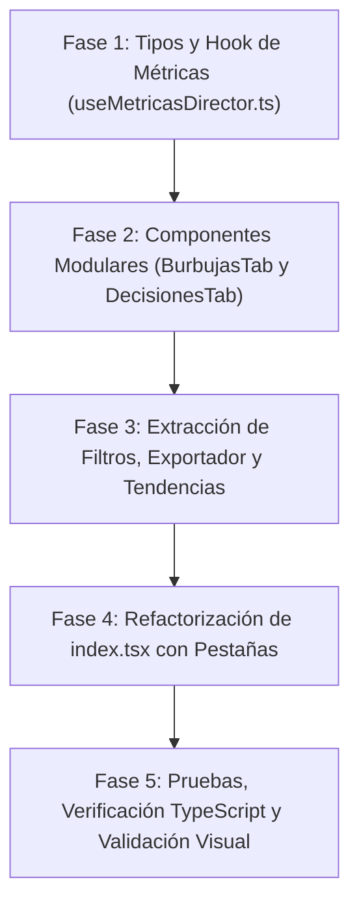

# 📋 Plan de Arquitectura e Implementación: Burbujas, Decisiones y Modularización del Reporte del Director

> **Objetivo:** Incorporar las vistas pedagógicas de **Matriz de Burbujas de Rezago** y **Panel de Decisiones y Alertas** al reporte de evaluaciones de Directores ([pages/directores/evaluaciones/evaluacion/reporte/index.tsx](file:///home/frecodev/Documentos/eva/pages/directores/evaluaciones/evaluacion/reporte/index.tsx)), adaptadas a los datos de la Institución Educativa (Secciones, Docentes, Estudiantes, Preguntas), implementando un sistema moderno de **pestañas (Tabs)** y una **refactorización modular** que reduzca el archivo de **1,364 líneas a ~300 líneas**.

---

## 1. 🎯 Diagnóstico y Justificación

### Estado Actual de `pages/directores/.../reporte/index.tsx`
* **1,364 líneas de código** en un solo archivo monolítico.
* Múltiples responsabilidades acopladas:
  * Manejo de URL query params y sincronización de fecha.
  * Menú desplegable de exportación (Excel, PDF Grilla, PDF Preguntas) con detección de clics externos.
  * Formulario de filtros (Nivel, Grado, Sección, Género, Ordenamiento, Visibilidad de columnas).
  * Renderizado de la tabla de estudiantes.
  * Gráficos apilados verticalmente mediante acordeones colapsables (`mostrarGraficos`, `mostrarReportePreguntas`).
  * Dropdown con buscador y selección múltiple para comparar evaluaciones.
  * Generación off-screen de gráficos para exportación a PDF.

### Solución Propuesta
1. **Sistema de Navegación por Pestañas (Tabs):** Eliminar el scroll infinito de acordeones y permitir que el Director navegue fluidamente entre vistas especializadas.
2. **Modularización:** Descomponer los bloques en componentes independientes ubicados en `components/reportes/director/`.
3. **Incorporación Pedagógica:** Agregar **Matriz de Burbujas** y **Panel de Decisiones** adaptados a la jerarquía de la I.E.

---

## 2. 🏛️ Adaptación Conceptual: Nivel Regional vs Nivel Director

| Dimensión | Vista Regional (`matriz-resultados`) | Vista del Director (`reporte/index.tsx`) |
| :--- | :--- | :--- |
| **Entidad Principal (Filas)** | UGELs / Provincias | **Secciones / Aulas** (ej. 1° A, 1° B...) + Fila Resumen **"Total I.E."** |
| **Columnas** | Preguntas evaluadas ($P01, P02 \dots P_n$) | Preguntas evaluadas ($P01, P02 \dots P_n$) |
| **Cálculo de Celda (Burbuja)** | % de alumnos en Previo al Inicio en la UGEL | % de alumnos de esa **sección** que fallaron la pregunta |
| **Alertas en Decisiones** | Criticidad de UGELs por ítem curricular | Criticidad de **Secciones y Docentes** por ítem curricular |
| **Acción Pedagógica** | Asistencia técnica y talleres a especialistas UGEL | **Actuación docente en aula** (`preguntaDocente` configurada en el ítem) |

---

## 3. 🗂️ Estructura de Pestañas (Tabs)

El contenedor principal tendrá una barra de pestañas superior ergonómica con iconos representativos:

```
┌────────────────────────────────────────────────────────────────────────────────────────────────────────┐
│ [📋 Estudiantes y Grilla]  [🫧 Matriz de Burbujas]  [🎯 Alertas y Decisiones]  [📈 Tendencias]  [📑 Por Ítem] │
└────────────────────────────────────────────────────────────────────────────────────────────────────────┘
```

1. **📋 Estudiantes y Grilla:**
   * Tabla interactiva de estudiantes evaluados, respuestas marcadas, puntajes y niveles de logro.
   * Filtros de búsqueda (Nivel, Sección, Género, Orden) y configuración de columnas visibles.
2. **🫧 Matriz de Rezago (Burbujas):**
   * Matriz visual: Filas = Secciones (+ Total I.E.), Columnas = Ítems evaluados ($P01 \dots P_n$).
   * Escala de 7 niveles de burbuja (diámetro y color desde verde $\le 15\%$ hasta rojo intenso $> 65\%$).
   * Clic en celda/cabecera para abrir popover interactivo con el texto del ítem y su actuación docente.
   * Botón de guía metodológica: *¿Cómo interpretar este gráfico?* (modal explicativo).
3. **🎯 Alertas y Decisiones Pedagógicas:**
   * **Barra Compacta de KPIs:** Conteo de alertas Críticas ($\ge 60\%$), Altas ($50-59\%$), Medias ($40-49\%$), Bajas ($<40\%$) y Promedio General de la I.E.
   * **Tabla Ejecutiva Master-Detail por Sección:**
     * Ranking de aulas ordenadas por mayor rezago pedagógico.
     * Alertas por sección (chips con conteo de 🔴, 🟠, 🟡, 🟢).
     * Ítem más crítico con chip directo interactivo.
     * **Acción prioritaria sugerida** para el docente a cargo de la sección.
     * Despliegue interactivo (acordeón por aula) para ver el estado de todas las preguntas.
   * Botón de configuración de baremo y botón de guía metodológica.
4. **📈 Tendencias y Cobertura:**
   * Gráfico circular de distribución por niveles de logro y cobertura (evaluados vs pendientes).
   * Comparativa de niveles entre secciones y docentes.
   * Buscador multiselector para comparar tendencias con otras evaluaciones de la plataforma.
5. **📑 Análisis por Pregunta:**
   * Desglose estadístico detallado de cada pregunta con la distribución porcentual de alternativas (A, B, C, D) y la clave correcta.

---

## 4. 🧩 Plan de Modularización (Componentes a Crear)

Crearemos el directorio: `components/reportes/director/`

```
components/reportes/director/
├── types.ts                        # Definición de tipos de datos para métricas del director
├── useMetricasDirector.ts          # Hook con cálculos memoizados en memoria O(N x P)
├── DirectorTabsNav.tsx             # Barra de pestañas con estados activos y badges
├── DirectorExportMenu.tsx          # Menú de exportación PDF / Excel con click-outside
├── DirectorFiltrosBar.tsx          # Selectores de filtros y menú de visibilidad de columnas
├── DirectorBurbujasTab.tsx         # Vista completa de Matriz de Burbujas
├── DirectorDecisionesTab.tsx       # Vista completa de Alertas y Decisiones pedagógicas
├── DirectorTendenciasTab.tsx       # Gráficos de tendencias, cobertura y comparativa
└── DirectorBurbujasTab.module.css  # Estilos limpios y optimizados para burbujas y decisiones
```

### Impacto de Reducción en `index.tsx`:

| Módulo Extraído | Líneas Removidas de `index.tsx` |
| :--- | :--- |
| `DirectorExportMenu.tsx` | ~90 líneas |
| `DirectorFiltrosBar.tsx` | ~120 líneas |
| `DirectorTendenciasTab.tsx` (incluye selector múltiple) | ~180 líneas |
| `DirectorBurbujasTab.tsx` + `DirectorDecisionesTab.tsx` | ~0 (código nuevo modular en lugar de 800 líneas inline) |
| Lógica de cálculo a `useMetricasDirector.ts` | ~100 líneas |
| **Total reducción neta en `index.tsx`** | **De 1,364 líneas a ~280-320 líneas** |

---

## 5. ⚡ Algoritmo y Rendimiento: `useMetricasDirector.ts`

Para garantizar fluidez instantánea al cambiar de pestaña o filtrar datos:
1. **Pase Único de Agregación:**
   En un solo recorrido lineal $O(N)$ sobre los `estudiantesFiltrados`:
   * Se acumulan los aciertos y fallos por `[seccionId][orderPregunta]`.
   * Se acumula el consolidado global de la I.E. por `[orderPregunta]`.
2. **Cálculo de Criticidad:**
   * Se genera la lista de métricas por sección: `% rezago = (falladas / total) * 100`.
   * Se clasifica cada ítem en los 4 niveles del baremo (Crítico, Alto, Medio, Bajo).
   * Se ordenan las secciones de mayor a menor criticidad para la tabla ejecutiva de decisiones.
3. **Reutilización:**
   * Utiliza directamente `QuestionDetailPopover` para la previsualización de preguntas sin recrear componentes duplicados.
   * Utiliza `GuiaBurbujasModal` y `GuiaDecisionesModal` ya disponibles en el sistema.

---

## 6. 📅 Fases de Ejecución



### Detalle de Fases:
* **Fase 1: Base de Datos y Lógica:**
  * Crear `types.ts` y el hook `useMetricasDirector.ts`.
  * Probar que el cálculo de rezago y aciertos por aula sea 100% fiel a los resultados de los estudiantes.
* **Fase 2: Vistas de Burbujas y Decisiones:**
  * Crear `DirectorBurbujasTab.tsx` con su matriz interactiva, tooltips y popover de ítems.
  * Crear `DirectorDecisionesTab.tsx` con KPIs de criticidad, tabla ejecutiva Master-Detail y recomendaciones de actuación docente.
* **Fase 3: Extracción Modular Existente:**
  * Crear `DirectorExportMenu.tsx` (preservando todas las funciones de descarga Excel y PDF).
  * Crear `DirectorFiltrosBar.tsx` (preservando sincronización con URL query).
  * Crear `DirectorTendenciasTab.tsx` (agrupando GráficoTendenciaColegio y comparativa).
* **Fase 4: Ensamblaje en `index.tsx`:**
  * Montar la barra de pestañas en `index.tsx`.
  * Conectar las 5 vistas con transiciones suaves.
  * Verificar que la generación de imágenes para el PDF de preguntas (`forceOneColumn`) siga funcionando sin alteraciones.
* **Fase 5: Validación Integral:**
  * Ejecución de linting / validación TypeScript (`npx tsc --noEmit` o build test).
  * Comprobación de que no se modifiquen comportamientos de permisos (`accionesDirector`, `isAuditing`).

---

## 7. 🛡️ Garantías y Reglas de Compatibilidad

* **Preservación de Datos:** No se modificará ninguna función de carga en Firebase ni el contexto global (`useGlobalContext`, `useReporteDirectores`).
* **Descargas Intactas:** Las descargas de Excel y PDF de la grilla seguirán recibiendo exactamente los mismos datos filtrados.
* **Código Limpio:** Cumplimiento de las reglas del proyecto (`AGENTS.md`) y estándares de accesibilidad y UI/UX (`ui-ux-design`).
